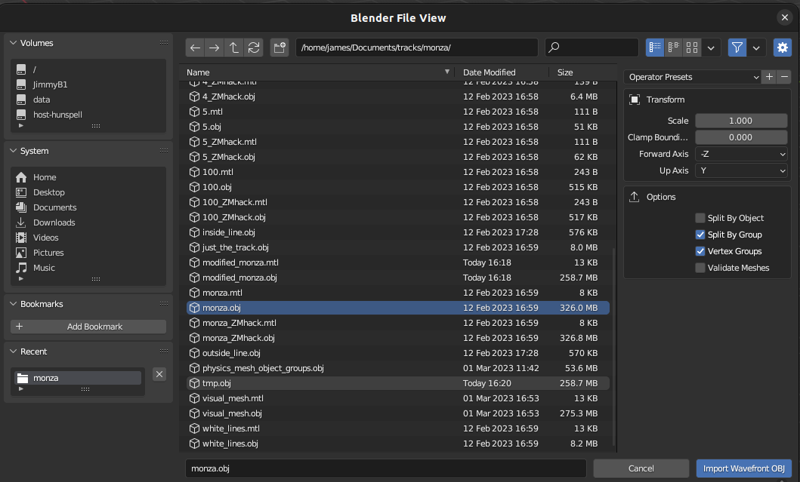

# Assetto Corsa Data Generator
Using data sources from the games static files we have developed a series of generators for common machine learning vision tasks.


## Video Tutorials
A series of video tutorials showing how to generate data with ACDG and add support for new tracks are avaialble on [our wesbite](https://adelaideautonomous.racing/docs/acdg/getting-started/tutorials/).

## Usage
In `generate_data.py` the `MultiprocessDataGenerator` class can be configured to iterate over samples in a folder made by the interfaces recording harness.
An example configration can be seen in `configs/monza.yaml`.
We provide a docker compose file to run data generation jobs by running: `docker compose --project-directory ./docker/ up -d`.
To change which configuration is being used you can modify the line in `docker/compose.yaml` that sets the `CONFIG_PATH` environment variable.
For each frame, or a sub sampling of frames, it can generate semantic segmentation maps, normal maps and depth maps from the perspective of the car when a sample was recorded.
To add a new type of data inherit from `generator/base.py` and register the generator in `DATA_GENERATORS` in `generator/generator.py`.
To modify how data is generated you can make changes to the respective `DataGenerator`.

## Adding Tracks
Each track needs to be manually inspected and a file with associated constants created prior to being able to use the generator, see `tracks/monza.py` and register the `TrackData` object in `tracks/tracks.py`.
Introduction of a new map requires each vertex groups semantic label to be decided on, any vertex groups that should be removed and any that require their materials to be modified so they are distinguishable from an important class.
We usually open the mesh in blender to inspect any classes that are ambiguous and progressively refine them based on visualisation of the coded rules.
Similarly car specific camera positioning data needs to be registered in the `cars/` folder.

## Camera Configuration
The details for camera offset and pitch can be found in the game files for each car.
Specifically, each car has a `car.ini` file inside a `data.acd` archive that you need to unpack with content manager to access.

## Editing Tracks In Blender
After parsing game kn5 files to a `.obj` file you may need to inspect and adjust certain objects that are semantically different but are textured using the same material.
First import `<track_name>.obj` into blender.


After making any changes to mesh export it using the following settings:

Then open up the exported `.obj` in a text editor and use `Find and replace` to change all the occurrences of `o ` to `g `. 
(*Note:* This is a bug in blender as vertex groups in obj should have a g prefix)

## Commbing Duplicate Materials
When importing several different `.obj` files into blender it will automatically generate two seperate materials if the same name is used in two different objects.
In our case these do refere to the same materials and are genuine duplicates.
To combine these you can go to the `scripting` tab of blender and run this snippet:
```python
import bpy

mats = bpy.data.materials

for mat in mats:
    (original, _, ext) = mat.name.rpartition(".")
    
    if ext.isnumeric() and mats.find(original) != -1:
        print("%s -> %s" %(mat.name, original))
        
        mat.user_remap(mats[original])
        mats.remove(mat)
```
[Credit to Kei MURATAGAWA](https://blender.stackexchange.com/questions/75790/how-to-merge-around-300-duplicate-materials)

## Citation
If you use ACDG in your research or quote our baselines please cite us in your work:
```BibTeX
@misc{bockman2024aarkopentoolkitautonomous,
      title={AARK: An Open Toolkit for Autonomous Racing Research}, 
      author={James Bockman and Matthew Howe and Adrian Orenstein and Feras Dayoub},
      year={2024},
      eprint={2410.00358},
      archivePrefix={arXiv},
      primaryClass={cs.RO},
      url={https://arxiv.org/abs/2410.00358}, 
}
```
